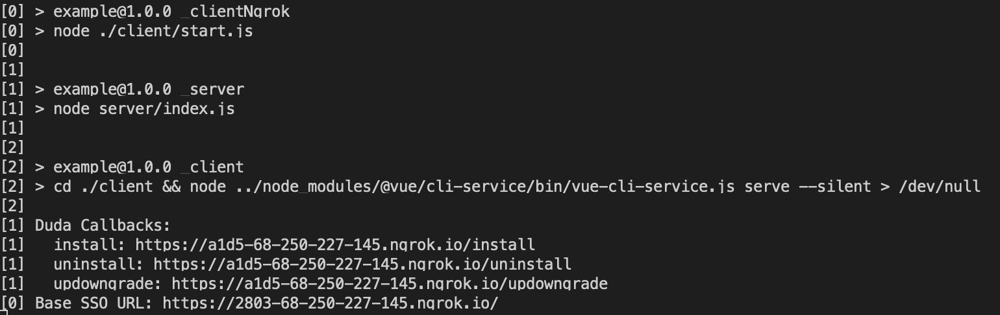

# Duda App Store Example

This repo contains a simple frontend and backend to demonstrate the lifecycle and integration touchpoints of a Duda app.

## Usage

1. Clone the repo
2. Run `npm run go`

3. Update your app manifest with the generated URLs
4. Install and open your app